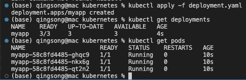
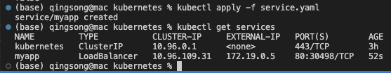
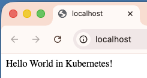
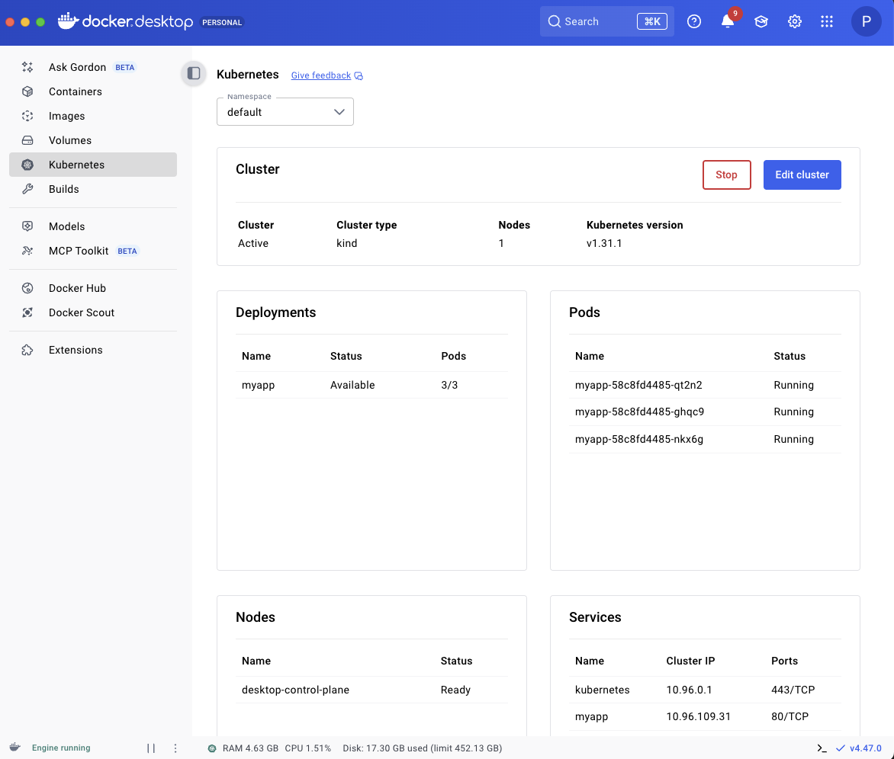
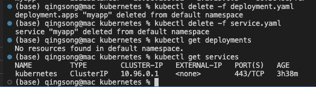
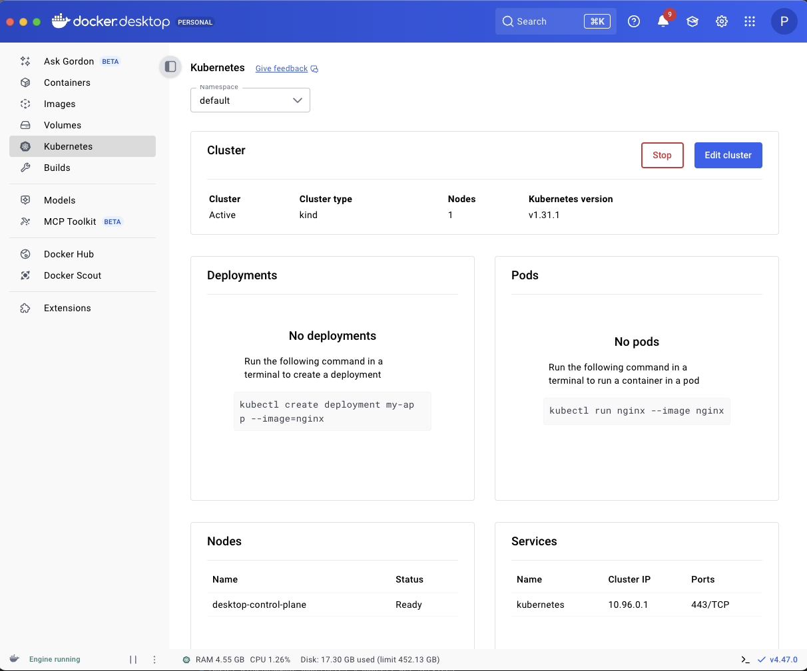

We will create our first example with Kubernetes starting from scratch, using:

- JavaScript
- Node.js
- Docker
- Docker Compose
- Kubernetes

# 📃 Requirements

- Node.js
- Docker (with Kubernetes enabled)

# 🚀 Getting Started

Let's start in a new VS Code window (or any other editor of your choice).

## 1. Create a new project

```
npm init -y
```

## 2. Install the dependencies

```
npm i express
```

## 3. Create a new file called `index.js`

```
touch index.js
```

Let's create a simple Express server that listens on port 3000 and returns a response.

```
//simple express server
const express = require('express');
const app = express();

app.get('/', (req, res) => {
  res.send('Hello World!');
});

app.listen(3000, () => {
  console.log('Example app listening on port 3000!');
});
```

Run this by typing:

```
node index.js
```

Now it's time to Dockerize our application

# Dockerize our application

We will dockerize the application by creating three files:

- .dockignore
- Dockerfile
- docker-compose.yml

```
touch .dockignore Dockerfile docker-compose.yml
```

## ❌ .dockignore

Add node_modules to the file

## 🐳 Dockerfile

Open the `Dockerfile` and add the following:

```
FROM node:19-alpine

# Create app directory
WORKDIR /app

# Copy package.json and package-lock.json
COPY package*.json ./

# Install dependencies
RUN npm install

# Copy source code
COPY . .

# Expose port 3000
EXPOSE 3000

# Run the app
CMD [ "node", "index.js" ]
```

To build the app, let's populate the docker-compose.yml file with the following:

```
version: '3.9'

services:
  myapp:
    container_name: myapp
    image: myapp:1.0.0
    build: .
    ports:
      - 3000:3000
```

Explanation of the docker-compose.yml file:

* version: '3.9' - the version of the docker-compose file
* services: - the services (containers) we want to run. In this case, just one.
* myapp: - the name of the service
* container_name: myapp - the name of the container
* image: myapp:1.0.0 - the name of the image
* build: . - the path to the Dockerfile. In this case, the current directory.
* ports: - the ports that we want to expose. In this case, port 3000 of the container will be exposed on port 3000 of the host machine.

Before we test it with Docker, let's modify the index.js file by changing Hello World! to Hello Docker!

```
//simple express server
const express = require('express');
const app = express();

app.get('/', (req, res) => {
  res.send('Hello Docker!');
});

app.listen(3000, () => {
  console.log('Example app listening on port 3000!');
});
```

Now let's run the container by typing this in the terminal:

```
docker compose up
```

Nice! Nice! Now it's the turn of Kubernetes.

But before we do that, let's change the `Hello Docker!` to `Hello Kubernetes!`

```
//simple express server
const express = require('express');
const app = express();

app.get('/', (req, res) => {
  res.send('Hello Kubernetes!');
});

app.listen(3000, () => {
  console.log('Example app listening on port 3000!');
});
```

Then rebuild the image by typing:

```
docker compose build
```

# ☸️ Kubernetes
Before we start, be sure Kubernetes is enabled in Docker Desktop.

**Pods, Deployments, and Services**

Kubernetes is a container orchestration tool. It is used to manage multiple containers on multiple hosts. In our case, we will use our machine as a single host.

We will keep it as minimal as possible by creating a deployment and a service.

Just three definitions to get started as soon as possible.

**pod:** the smallest deployable unit of computing that can be created and managed in Kubernetes.

**deployment:** a Kubernetes object that manages a set of pods. It is responsible for creating and updating pods.

**service:** an abstraction that defines a logical set of pods and a policy by which to access them. They are used to expose a set of pods to external traffic.

# Create the deployment

We will create a deployment in less than 20 lines of code.

At the root of the project, create a new file called `deployment.yaml` and add the following:

```
apiVersion: apps/v1
kind: Deployment
metadata:
  name: myapp
spec:
  replicas: 3
  selector:
    matchLabels:
      app: myapp
  template:
    metadata:
      labels:
        app: myapp
    spec:
      containers:
        - name: myapp
          image: myapp:1.0
          ports:
            - containerPort: 3000
```

⚠️ You might see a warning in the last five lines, but it's only because this configuration might eat a lot of resources. But let's keep it simple for now.

* Explanation of the deployment.yaml file:
* apiVersion: apps/v1 - the version of the Kubernetes API
* kind: Deployment - the kind of object we want to create. In this case, a deployment.
* name: myapp - the name of the deployment
* replicas: 3 - the number of replicas of the deployment
* image: myapp:1.0 - the image of the container. We defined this in the docker-compose.yml file
* ports: - the ports of the container. 3000 in this case.

Before we create the deployment, let's check if there are any deployments in the cluster:

```
kubectl get deployments
```

Let's create the deployment by typing:

```
kubectl apply -f deployment.yaml
```

Then let's try to get the deployments again:

```
kubectl get deployments
```

We can also get a details of the pods

```
kubectl get pods
```




As you can see, we have 3/3 pods running (we defined replicas: 3 in the deployment.yaml file).

But creating a deployment is not enough. We need to expose the deployment to the outside world!

# 🌐 Create the service
We will create a service in 11 lines of code.

At the root of the project, create a new file called service.yaml and add the following:

```
piVersion: v1
kind: Service
metadata:
  name: myapp
spec:
  selector:
    app: myapp
  ports:
    - port: 80
      targetPort: 3000
  type: LoadBalancer
```

This is enough to expose the deployment to the outside world (port 80)

Before we apply this configuration, let's check if there are any services in the cluster:

```
kubectl get services
```

There is one called Kubernetes but that's the default service that is created when you install Kubernetes.

Let's create the service by typing:

```
kubectl apply -f service.yaml
```

Then let's try to get the services again:

```
kubectl get services
```



Finally, visit localhost:80 in your browser and you should see `Hello World in Kubernetes!`






# 🧹 Clean up
To clean up, delete the deployment and the service:

```
kubectl delete -f deployment.yaml
kubectl delete -f services.yaml
```




# 🏁 Conclusion
We did it! We created our first example with Kubernetes starting from scratch, using:

- JavaScript
- Node.js
- Docker
- Docker Compose
- Kubernetes

